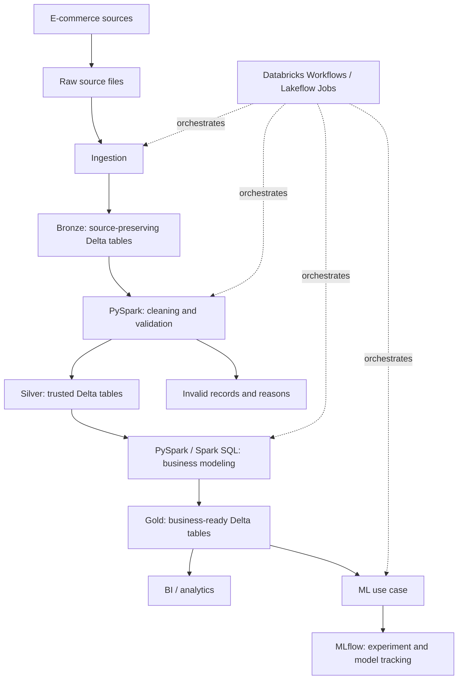

# Modern Data Platform

An E-commerce Analytics & Customer Intelligence portfolio project, built one phase at a time to develop practical Data Engineering skills.

**Current status: Phase 0 — project foundation.** The repository contains documentation and reserved folders. Datasets, pipelines, Delta tables, dashboards, and models have not been implemented. The Phase 0 understanding review is the next checkpoint.

## Business problem

An e-commerce business needs dependable answers about sales, products, and customer behavior. Source records alone are insufficient: duplicate orders can inflate revenue, invalid payments can distort results, and inconsistent dates can place sales in the wrong reporting period.

The eventual platform will turn source data into traceable, validated datasets and clearly defined business metrics. Planned questions include daily sales, monthly revenue, product performance, customer lifetime value, and repeat customer rate. Metric definitions will be agreed before implementation; for example, an order total is not automatically recognized revenue.

## Target architecture



This is a target design, not a diagram of deployed infrastructure. Quality checks will accompany the transformations; Phase 4 will develop a reusable quality framework.

| Layer | Responsibility in this project | Why it exists |
| --- | --- | --- |
| Raw | Retain the received source files. | Keep the original input available for investigation and replay. |
| Bronze | Preserve source values in Delta tables, with ingestion and source metadata. | Make arrivals traceable without prematurely applying business cleaning. |
| Silver | Validate, normalize, and deduplicate records; record rejected records and reasons. | Give downstream consumers a trusted, detailed dataset. |
| Gold | Build business models and agreed metrics from trusted data. | Make reporting consistent and easier to use. |

These responsibilities follow the [medallion design pattern](https://docs.databricks.com/aws/en/lakehouse/medallion). Separating them makes it easier to identify where a problem entered the pipeline. The trade-off is additional storage, processing steps, and operational work.

## Technology roles

| Technology | Role | Introduction |
| --- | --- | --- |
| Python | Reusable modules, source generation, configuration, and tests. | Phase 1 runnable code |
| SQL | Queries, joins, and business calculations. | Exploration and later modeling |
| PySpark | Python API for describing Spark data processing. | Phase 2 onward |
| Apache Spark | Processing engine that can distribute work across machines. | Phase 2 onward |
| Databricks | Managed environment for running and inspecting data workloads. | Execution setup before Phase 2 |
| Delta Lake | Transactional table storage based on Parquet data files and a log. | Phase 2 onward |
| Databricks Workflows | Scheduling, task dependencies, retries, and run monitoring. | Phase 7 |
| MLflow | Tracking ML experiment parameters, metrics, and saved models. | Phase 9 |

The orchestration capability is called **Lakeflow Jobs** in current [Databricks documentation](https://docs.databricks.com/aws/en/jobs/). This project retains the term Databricks Workflows from its brief and notes the current name for navigation.

Read [the architecture guide](docs/architecture.md) for explanations of Spark versus PySpark, Parquet versus Delta Lake, and processing versus orchestration.

## Repository structure

```text
modern-data-platform/
├── README.md
├── requirements.txt
├── .gitignore
├── data/
│   ├── raw/
│   └── samples/
├── src/
│   ├── ingestion/
│   ├── bronze/
│   ├── silver/
│   ├── gold/
│   ├── quality/
│   └── utils/
├── notebooks/
│   ├── exploration/
│   └── databricks/
├── tests/
├── config/
│   └── README.md
├── docs/
│   ├── architecture.md
│   ├── databricks_setup.md
│   ├── data_model.md
│   ├── phase_0.md
│   └── decisions/
│       └── 0001-phase-0-foundation.md
└── scripts/
```

Reserved folders contain `.gitkeep` files so Git can retain them. A `.gitkeep` has no runtime behavior. The folders under `src/` are locations for future modules, not implemented Python packages.

Reusable processing logic will live in modules. Notebooks will support exploration and small execution entry points. This makes code easier to review, test, and reuse, while keeping notebooks useful for learning.

## Data model

The initial source entities will be `customers`, `products`, `orders`, `order_items`, and `payments`. Their requested fields and the decisions still to make are recorded in [the source outline](docs/data_model.md).

Gold facts, dimensions, keys, and table grains will be designed together in Phase 5. No Gold model is finalized in this scaffold. **Grain** means what one row represents; we will state it before creating any table.

## Data quality and reliability

The project brief requires invalid records to remain inspectable rather than disappear silently. Silver processing will eventually capture rejected records with their source context and failure reasons. The rule set and quarantine design remain learning decisions for Phases 3 and 4.

For each future pipeline, we will explain and verify:

- What happens if it runs twice?
- What happens if it fails halfway?
- What happens if the source sends duplicates?
- What happens if the source schema changes?
- What happens if yesterday's data arrives today?

These are future acceptance criteria, not reliability features already implemented. Meaningful tests will start with the first runnable code and grow alongside the project. Delta transactions alone do not make a pipeline idempotent: appending the same input twice can still produce duplicates.

## Getting started in Phase 0

1. Read [the architecture guide](docs/architecture.md).
2. Inspect the folders and [the foundation decision record](docs/decisions/0001-phase-0-foundation.md).
3. Answer the five questions in [the Phase 0 learning checkpoint](docs/phase_0.md).
4. Review your reasoning with your mentor before starting Phase 1.

**No installation is needed to inspect this phase.** `requirements.txt` intentionally contains only comments because there is no executable project code yet. Do not install Spark, Delta Lake, MLflow, or other future dependencies just to fill this file.

You selected Databricks and need help getting workspace access. Start with [the Databricks access guide](docs/databricks_setup.md), which recommends Free Edition for this personal learning project. Account creation and working workspace access have not been verified. Before Phase 2, we will confirm the available environment and supported APIs. The managed environment provides Spark and Delta capabilities; project-specific dependencies will be added only when code requires them.

Generated raw data will be kept outside Git tracking under `data/raw/`. Small, reviewed synthetic examples may later be committed under `data/samples/`. This keeps the repository reproducible through code and focused examples rather than growing data dumps.

## Git workflow

Use a focused branch for each increment: `feature/<description>`, `fix/<description>`, `refactor/<description>`, `docs/<description>`, `test/<description>`, or `chore/<description>`. Review the diff and run the checks appropriate to the change before making a small commit.

Examples of conventional-style commit messages:

- `chore: scaffold phase 0 project foundation`
- `feat: add synthetic ecommerce source generation`
- `docs: explain bronze source preservation`
- `test: validate generated order relationships`

## Roadmap

| Phase | Scope | Status |
| --- | --- | --- |
| 0 | Setup, architecture, and understanding review | Scaffold prepared; review pending |
| 1 | Realistic raw e-commerce datasets | Planned |
| 2 | Raw to Bronze Delta ingestion | Planned |
| 3 | Bronze to Silver PySpark transformations | Planned |
| 4 | Reusable data quality framework | Planned |
| 5 | Silver to Gold dimensional modeling | Planned |
| 6 | Incremental processing and idempotency | Planned |
| 7 | Databricks Workflows orchestration | Planned |
| 8 | BI analytics layer | Planned |
| 9 | ML use case and MLflow | Planned |
| 10 | Broader testing, monitoring, CI/CD, documentation, and optimization | Planned |
| 11 | Optional PostgreSQL, CDC, Kafka, and Structured Streaming extension | Optional |

Airflow, dbt, Docker, cloud storage provisioning, and other extensions will be considered only when a later phase has a concrete need. There are currently no analytics results, deployed workflows, performance claims, or ML results to report.

## Learning approach

Before an important architectural, SQL, Spark, modeling, partitioning, or quality decision, we will explain the problem and trade-offs, let you propose an approach, review your reasoning, and then implement it together. Boilerplate can be handled directly.

Each major phase ends with a summary of what was built, the concepts you should understand, and interview questions. Finishing the repository is secondary to being able to explain and defend its engineering decisions.
