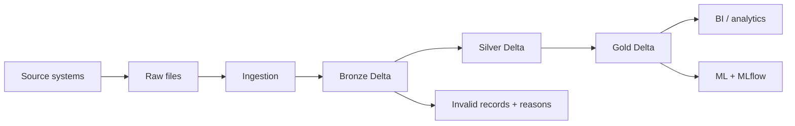

# Architecture guide

## Status and purpose

This document explains the target platform. Phase 0 implements its repository foundation only. The target stack and medallion structure come from the project brief; detailed implementation choices will be discussed with the learner in their relevant phases.

The business needs reliable sales and customer information. A useful pipeline must do more than move files: it must preserve evidence, establish trust, and define what its outputs mean.

## Follow one order through the platform

Imagine a source file containing order `O-100`. Its timestamp is written in an unfamiliar date format, and a later file may repeat the same order.



**Raw** is the landing area for the original source file. The original bytes are useful if a reader misinterprets a field or a later schema change requires a different parser. Initial local files will go in `data/raw/`; cloud storage locations will be chosen in a later phase.

**Ingestion** reads arrivals and records their source context. It transfers data into a form the platform can process. It is distinct from deciding whether an order is valid for revenue reporting.

**Bronze** will retain source values as closely as practical in Delta tables, adding metadata such as source identity and ingestion time. We should still be able to investigate the unfamiliar date and repeated arrival. Minimal transformations protect that evidence. The original Raw file and a Bronze table serve related but different purposes: one preserves the received file, the other provides a queryable ingestion history.

**Silver** will interpret types, normalize values, validate business rules, and resolve duplicates using a strategy we discuss first. Invalid records will remain inspectable with reasons and source context. A storage format cannot decide whether a payment is valid for our business.

**Gold** will organize trusted records into business models and metrics. It can contain detailed facts and dimensions as well as summaries. Before creating a Gold table, we will define its grain and business meaning. An order's status and payment history affect whether it should contribute to a revenue metric; that definition remains open.

**BI / analytics** will consume defined metrics to produce queries, reports, or dashboards. **ML** will eventually use suitable datasets for a customer intelligence use case. We will choose its prediction target and avoid using information unavailable at prediction time. MLflow records how experiments were run and how their models performed; it does not replace training code.

The separation of Bronze, Silver, and Gold follows the [medallion architecture](https://docs.databricks.com/aws/en/lakehouse/medallion). Our example and business definitions are project design context, not a prescribed Databricks schema.

## Why preserve data in layers?

A single source-to-dashboard script may be quicker to build and uses fewer stored copies. It also mixes ingestion, cleaning, and metric definitions, making a wrong total harder to trace.

The planned layers provide separate checkpoints. If Silver parsing is incorrect, we can correct the logic and replay preserved input. If the business changes its revenue definition, we can rebuild downstream models without redefining source ingestion. A **backfill** processes historical input for a selected period, often after a correction or newly added requirement.

The trade-offs are additional storage, compute, and coordination. Retention and replay policies still need design; retaining Bronze does not by itself guarantee that every original file or historical Delta version exists forever.

## Technology roles

| Technology | Beginner-friendly role | Planned project use |
| --- | --- | --- |
| Python | A general-purpose language for writing programs. | Reusable modules, source generation, configuration, and tests. |
| SQL | A language for expressing what rows and calculations you want. | Exploration, joins, and business metrics using Spark SQL. |
| PySpark | The Python interface to Apache Spark. | Describe data reads, transformations, and writes. |
| Apache Spark | The engine that executes processing plans. | Run transformations on one machine or distribute them across workers. |
| Databricks | A managed platform where data workloads can run. | Workspace, notebooks, compute, table access, and operational tools. |
| Delta Lake | A transactional table format and storage layer. | Store Bronze, Silver, and Gold tables with a transaction log. |
| Databricks Workflows | Coordinate when pipeline steps run. | Dependencies, scheduling, retries, and monitoring in Phase 7. |
| MLflow | Record and compare machine learning experiments. | Parameters, evaluation metrics, and saved models in Phase 9. |

Official background: [Spark's Python API](https://spark.apache.org/docs/latest/api/python/index.html), [Spark SQL](https://spark.apache.org/docs/latest/sql-programming-guide.html), [Databricks platform architecture](https://docs.databricks.com/aws/en/lakehouse-architecture/reference), and [MLflow tracking](https://mlflow.org/docs/latest/ml/tracking/).

## Spark versus PySpark

Spark is the processing engine. PySpark is an API used to give Spark instructions from Python. SQL and PySpark DataFrame expressions can use the same underlying Spark SQL execution engine. Writing PySpark does not mean every record is processed sequentially by an ordinary Python loop. See the [PySpark overview](https://spark.apache.org/docs/latest/api/python/index.html).

In a typical distributed Spark application, a **driver** coordinates the application and **executors** run work on partitions, which are pieces of the dataset. Spark can also run locally for learning. Distribution has overhead, so using Spark does not automatically make a tiny dataset faster. We use it here to learn the target stack, not because our first sample requires a cluster. The [cluster overview](https://spark.apache.org/docs/latest/cluster-overview.html) explains these processes.

Later we will inspect lazy evaluation, jobs, stages, tasks, execution plans, and shuffles on real transformations. Those concepts are scheduled for the Spark phases rather than implemented in Phase 0.

## Parquet versus Delta Lake

**Parquet** is a column-oriented data file format. Column-based storage and compression suit many analytical reads. A collection of Parquet files alone does not supply Delta's table transaction protocol. See the [Parquet overview](https://parquet.apache.org/docs/overview/).

**Delta Lake** adds a transaction log to Parquet data files. The log records committed table changes and identifies a table's valid state. This supports transactional reads and writes rather than treating whichever files happen to be present as the complete table. See the [Delta Lake FAQ](https://docs.delta.io/delta-faq/).

**ACID** stands for atomicity, consistency, isolation, and durability. At an introductory level: a transaction commits as a unit, respects supported table constraints, handles concurrent access under its isolation rules, and preserves committed changes. Delta also provides schema enforcement, updates, deletes, merges, and historical version reads. See the [Delta Lake introduction](https://docs.delta.io/).

Two practical limits matter for this project:

- Table-level transactions do not make a whole multi-step workflow atomic. A Bronze write can succeed while a later Silver step fails. See [Delta transaction scope](https://docs.delta.io/delta-faq/).
- Time travel depends on retaining the necessary log and data files. It is not a permanent archive by default. See [Delta retention and utility commands](https://docs.delta.io/delta-utility/).

Plain Parquet can be a simpler choice for an immutable analytical export. Delta introduces metadata and protocol requirements in exchange for table-level reliability and managed changes. Our brief calls for Delta because later phases will teach those capabilities. Delta does not automatically remove duplicates, enforce relationships between source entities, or determine valid revenue.

## Databricks versus Spark

Spark is an open-source engine that can run in different environments. Databricks is a managed platform that provides compute and tools around workloads, including Spark. A notebook is one way to author and run code in that platform; it is not the Spark engine itself. See [Databricks reference architecture](https://docs.databricks.com/aws/en/lakehouse-architecture/reference).

A local setup offers direct control and a way to practice without workspace access, but requires compatible Python, Java, Spark, and Delta components. Databricks reduces environment-management work, while introducing workspace access, platform constraints, and potentially compute costs.

You selected Databricks and need help getting access. The [access guide](databricks_setup.md) recommends Free Edition for personal learning and explains signup. Workspace access has not yet been verified. We will confirm the available environment before Phase 2; no local Spark installation is needed for Phase 0.

## Databricks Workflows versus Spark

Spark executes the data computation inside a task. Workflows coordinates tasks: for example, run Bronze ingestion, then Silver validation, then Gold modeling only when dependencies have succeeded.

The current product documentation uses **Lakeflow Jobs** for this orchestration capability. A Databricks job is a workflow resource; a Spark job is a computation triggered inside a Spark application. They describe different levels of work. See [Lakeflow Jobs](https://docs.databricks.com/aws/en/jobs/) and [Spark's job glossary](https://spark.apache.org/docs/latest/cluster-overview.html).

The target workflow is:

```text
ingestion / Bronze → Silver → quality gate → Gold → analytics / ML
```

This is a planned task sequence. MLflow tracking accompanies the later ML task. No workflow configuration, schedule, or retry policy is deployed yet. A quality gate decides whether data is suitable for downstream use; detailed rules will be designed before that gate is implemented.

## Reliability questions to answer before implementation

| Situation | Question to resolve together | Relevant phase |
| --- | --- | --- |
| The same input is processed twice | How do we keep the intended output unchanged on replay? | Ingestion design; deepen in Phase 6 |
| A run fails between steps | What committed successfully, and where should a retry resume? | Each runnable phase; orchestration in Phase 7 |
| The source repeats a record | What identifies a duplicate, and which version should win? | Phase 3 |
| A new source field appears | Should it be retained, accepted into the trusted schema, or reviewed? | Phases 2–4 |
| An old event arrives today | How do event time and ingestion time affect processing and historical metrics? | Phase 3; deepen in Phase 6 |

**Idempotency** means repeating the same operation with the same input leaves the intended result unchanged after its first success. A successful Delta append repeated twice can still duplicate records. Transaction safety and pipeline idempotency are related requirements with different responsibilities.

Logging, exception handling, and tests will grow alongside executable code. A retry must be paired with a safe write strategy; automatic retries alone do not solve duplicated outputs.

## Decisions intentionally left for learning

- Databricks workspace access, available runtime features, and eventual storage locations.
- Source formats, data sizes, reproducibility, and the first intentional quality problem.
- Bronze schema strategy and ingestion metadata names.
- Duplicate identity, ordering rules, validation, and quarantine representation.
- Fact and dimension grains, metric definitions, and historical dimension behavior.
- Incremental boundaries, late-arrival handling, and backfill behavior.
- Partitioning and performance choices based on observed workloads.

We will discuss each problem and alternatives before you choose an approach. The foundation record is in [decisions/0001-phase-0-foundation.md](decisions/0001-phase-0-foundation.md).
